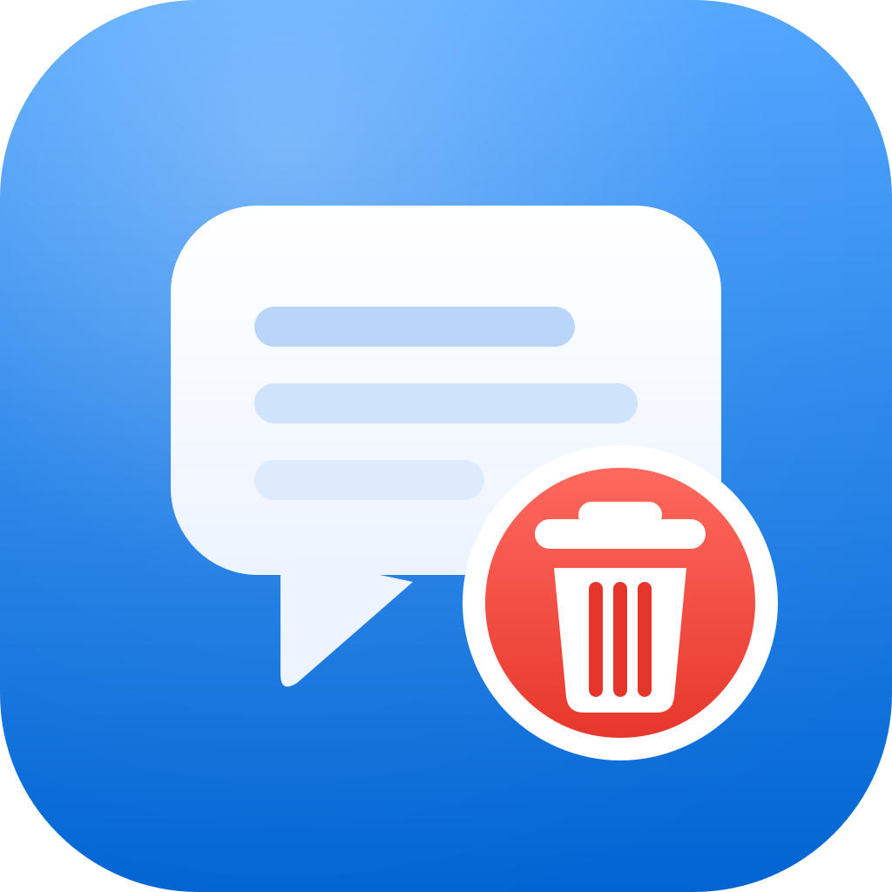

<div align="center">



# 🧹 Zcode Conversation Cleaner

**Zcode 对话删除程序** · 一眼即懂：**扫描 Zcode 客户端的全部对话记录，一键彻底删除对话与所有关联数据，不留残留。**

[](#)
[](#)
[](#)
[](LICENSE)
[](https://github.com/uahz/zcode-conversation-cleaner/releases/latest)

*Scan · Review · Delete — cleanly.*

</div>

---

## ✨ 这是什么？

[Zcode](https://zcode.z.ai)（Z.ai 出品的 AI 编程客户端）会在本机留下大量对话数据：桌面端索引库、CLI 会话库、会话产物、执行目录、图片缓存、日志……**客户端自带的删除往往删不干净。**

这个工具把这些藏在四个目录里的数据全部找出来，给你一张清晰的清单，点一下即可**连同消息正文、会话产物、执行痕迹、日志明文一起彻底清除**。

| 🎯 核心能力 | 说明 |
|---|---|
| 🔍 **全量扫描** | 桌面端索引库 ∪ CLI 会话库，显示标题、工作区、消息数、状态、更新时间、占用空间 |
| 👁 **内容预览** | 删除前可打开预览，查看完整对话文本（自动按角色/时间分组，可选中复制） |
| ☑️ **批量删除** | 勾选多条对话，一键批量删除；快捷清理「已完成 / 已出错 / 30 天前」 |
| 🗑️ **彻底清除** | 数据库行级删除 → WAL checkpoint + VACUUM 消除磁盘残留 → 级联删除关联文件 → 日志明文清洗 |
| 🛡️ **安全兜底** | 删除前自动备份至 `~/.zcode-cleaner-backup/`，可通过「恢复备份」一键还原 |
| 🌗 **深色模式** | 标题栏一键切换浅色 / 深色 / 跟随系统，QSS 全套变量重绘 |
| 🍎 **Apple 风格** | macOS 无边框圆角窗口、红绿灯按钮、圆角卡片、渐入动画、精致质感 |

## 🧨 删除时会清理什么？

| 数据位置 | 内容 | 处理方式 |
|---|---|---|
| `~/.zcode/v2/tasks-index.sqlite` | 桌面端对话索引（tasks / 分组 / 闲时任务） | 行级删除 + VACUUM |
| `~/.zcode/cli/db/db.sqlite` | 会话正文：消息、条目、TODO、用量等 10+ 张关联表 | 级联删除 + VACUUM |
| `~/.zcode/cli/rollout/` | 会话模型输入输出日志（`.jsonl`） | 整文件删除 |
| `~/.zcode/cli/artifacts/<会话>/` | 会话产物 | 整目录删除 |
| `~/.zcode/cli/exec/<会话>/` | 会话执行目录 | 整目录删除 |
| `~/.zcode/cli/image-cache/<会话>/` | 图片缓存 | 整目录删除 |
| `~/.zcode/v2/logs/`、`~/.zcode/cli/log/` | 含会话 ID 明文的应用日志 | 行级清洗 |

> 删除逻辑基于对本机 Zcode 实际数据结构的逆向确认，并在隔离环境的仿真数据库上通过全套自测（`selftest.py`）。

## 🚀 快速开始

> **💾 不想装环境？** 直接下载 [ZcodeConversationCleaner.exe](https://github.com/uahz/zcode-conversation-cleaner/releases/latest)（Windows 10/11，免安装，双击即用）。

```bash
# 1. 克隆
git clone https://github.com/uahz/zcode-conversation-cleaner.git
cd zcode-conversation-cleaner

# 2. 安装依赖（建议虚拟环境）
pip install -r requirements.txt

# 3. 运行
python main.py
```

Windows 用户也可以直接运行编译好的 `ZcodeConversationCleaner.exe`（免安装、无控制台窗口）。

## 🛡️ 安全设计

- **二次确认**：每次删除都弹出确认对话框，明确列出将要删除的内容
- **运行检测**：若检测到 Zcode 客户端正在运行，会提示先退出，避免数据被写回
- **自动备份**：删除前把两个 SQLite 数据库备份到 `~/.zcode-cleaner-backup/<时间戳>/`
- **失败保护**：数据库被占用 / 文件删除失败时，给出明确原因，列表不变更
- **异常兜底**：空列表、扫描失败均有友好提示，不会闪退

## ❓ FAQ

<details>
<summary><b>删除后 Zcode 客户端里还能看到对话吗？</b></summary>
不能。对话索引与会话数据都已删除，客户端刷新后列表中不再显示。
</details>

<details>
<summary><b>删错了还能恢复吗？</b></summary>
数据库部分可以。每次删除前会自动备份到 <code>~/.zcode-cleaner-backup/</code>，把备份文件复制回原位即可；会话关联文件（产物 / 日志）删除后不可恢复。
</details>

<details>
<summary><b>删除时需要先退出 Zcode 吗？</b></summary>
强烈建议。程序会自动检测 Zcode 进程并提醒你；不退出的话数据库可能被锁定，或删除后被客户端写回。
</details>

<details>
<summary><b>支持 macOS / Linux 吗？</b></summary>
数据扫描与删除逻辑与平台无关（都在 <code>~/.zcode</code> 下），理论上可用；GUI 的窗口样式目前按 Windows 优化。
</details>

## ⚠️ 免责声明

本项目与 Z.ai / Zcode 官方**无任何关联**，数据路径基于当前版本逆向分析，未来版本更新可能导致路径变化。删除操作不可逆（数据库部分有备份），请确认后再操作。

## 📄 License

[MIT](LICENSE) © [uahz](https://github.com/uahz)
